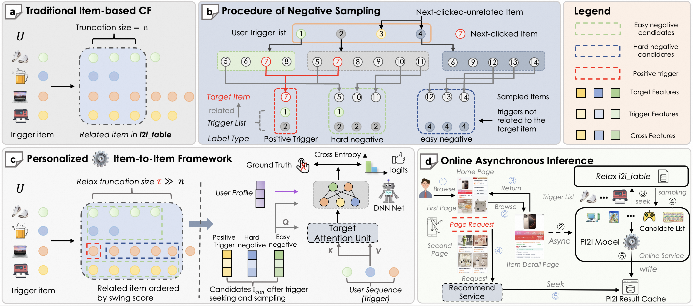
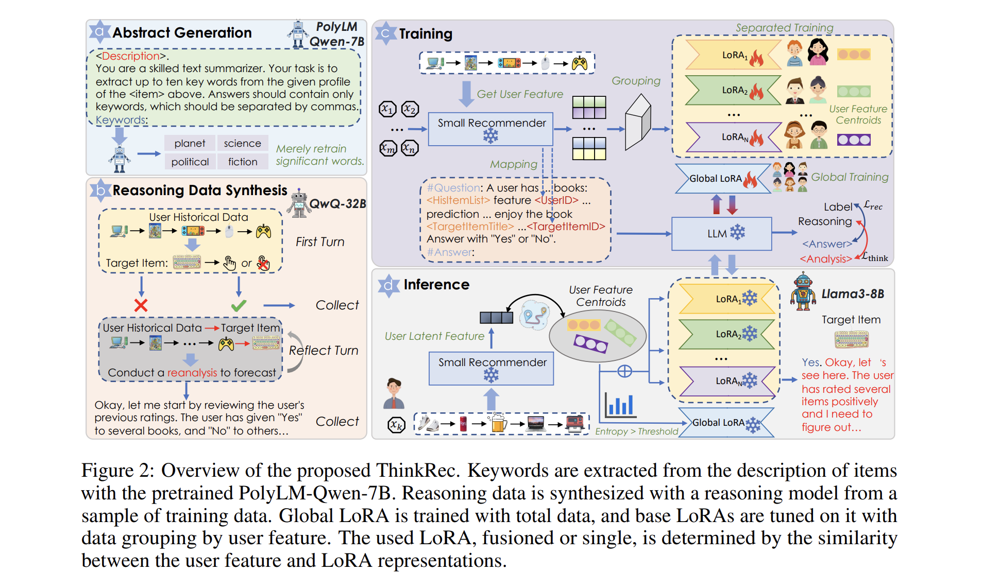
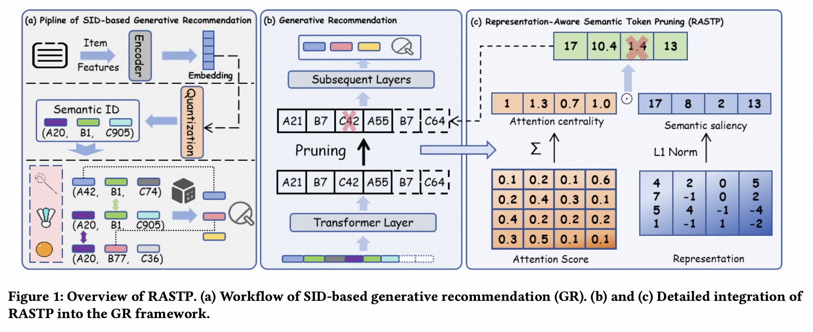
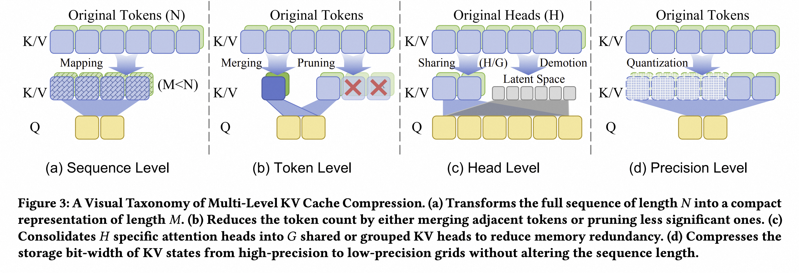
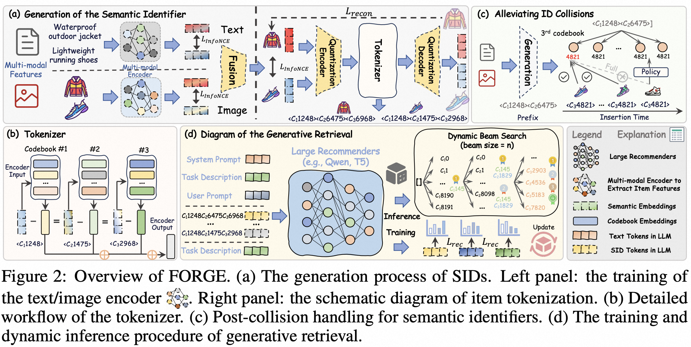
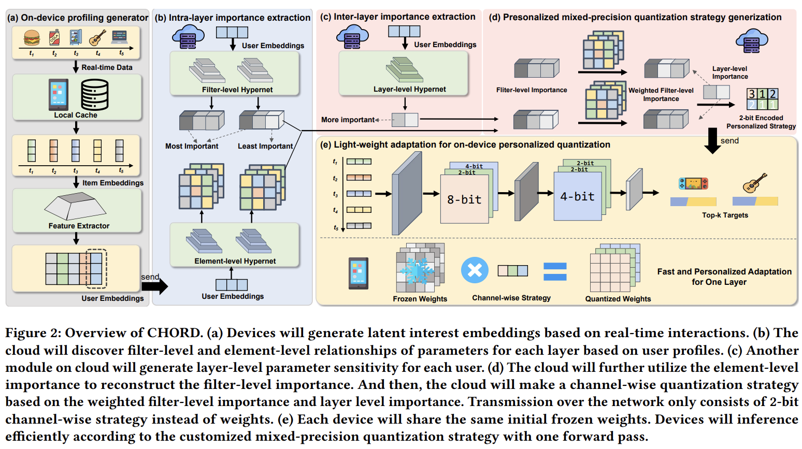
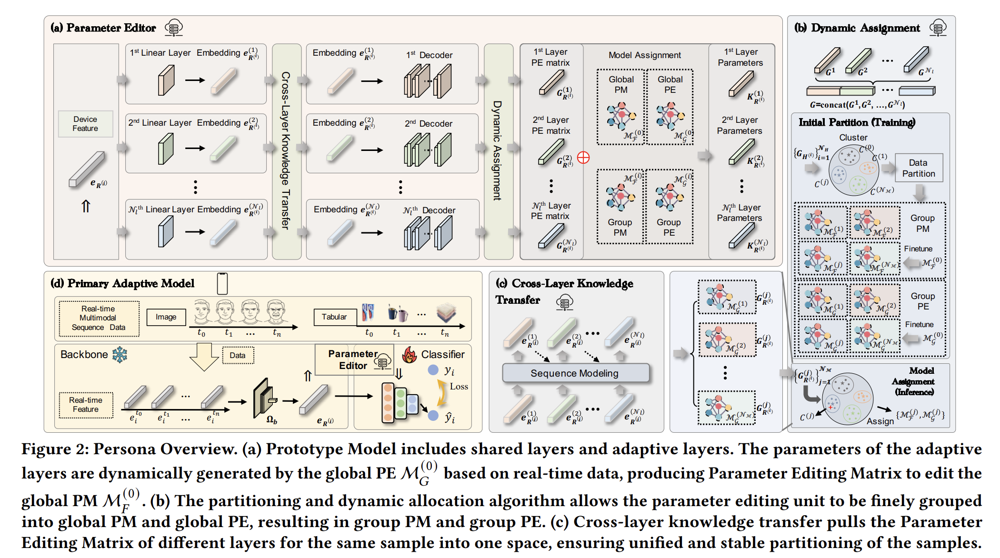








I am currently a third-year MS student at the College of Computer Science and Technology, Zhejiang University, under the supervision of Prof. [Kun Kuang](https://scholar.google.com/citations?hl=zh-CN&user=FOsNiMQAAAAJ&view_op=list_works&sortby=pubdate) and [Shengyu Zhang](https://scholar.google.com/citations?user=l4Dyt7EAAAAJ&hl=en).

My research primarily focuses on the generalizability and personalization of recommender systems. Recently, I am interested in both recommendations with large language models and the efficient inference of large recommenders when facing much longer user interaction sequences. Meanwhile, I also tackle the distinctive challenges involved in integrating heterogeneous models across diverse computational environments like mobile devices and cloud servers in a seamless and effective manner.

I am currently seeking job opportunities and will graduate in March 2026. If you have any suitable positions, please feel free to reach out.

# 🔥 News
- *2026.01*: &nbsp;🎉🎉 Three co-first-author papers have been accepted to the research/industry/short paper track of TheWebConf 2026.
- *2026.01*: &nbsp;📰📰 One paper has been available on Arxiv about large sequential recommendation.
- *2025.09*: &nbsp;📰📰 One paper has been deployed in Taobao and is available on Arxiv about generative retrieval with semantic identifiers.
- *2025.07*: &nbsp;🎉🎉 One co-first-author paper has been accepted to MM 2025.
- *2025.07*: &nbsp;🎉🎉 One paper has been accepted to MM 2025.
- *2025.07*: &nbsp;📊📊 Forward-OFA has been deployed in the Ascend Community of Huawei using [NPU](https://gitee.com/ouo-ovo/forward-ofa/).
- *2024.12*: &nbsp;🎉🎉 One co-first-author paper has been accepted to AAAI 2025.
- *2024.11*: &nbsp;🎉🎉 One first-author paper has been accepted to KDD 2025 August Cycle (Research Track).
- *2024.08*: &nbsp;🥳🥳 I went to Barcelona, Spain, to attend the KDD conference to deliver an oral presentation of our paper DIET.
- *2024.05*: &nbsp;🎉🎉 One first-author paper has been accepted to KDD 2024 (Research Track).
- *2023.07*: &nbsp;🥳🥳 I went to Fuzhou, China, to attend the CICAI conference to deliver an oral presentation and won the Best Paper Award.
- *2023.06*: &nbsp;🎉🎉 One first-author paper has been accepted to CICAI 2023.

# 📝 Publications

*\* denote the authors contributed equally.*

TheWebConf 2026

[PI2I: A Personalized Item-Based Collaborative Filtering Retrieval Framework](https://arxiv.org/abs/2601.16815)

Shaoqing Wang\*, Yingcai Ma\*, **Kairui Fu\***, Ziyang Wang, Dunxian Huang, YuliangYan, Jian Wu

- A novel two-stage retrieval framework that enhances the personalization capabilities of traditional collaborative filtering.
- Deployed on Taobao’s "Guess You Like" section, PI2I achieved a 1.05% increase in online transaction rates.

TheWebConf 2026

[ThinkRec: Thinking-based recommendation via LLM](https://arxiv.org/abs/2505.15091)

Qihang Yu\*, **Kairui Fu\***, Shengyu Zhang, Zheqi Lv, Fan Wu, Fei Wu

[Project](https://github.com/Yu-Qi-hang/ThinkRec)

- Almost the first emphasizes the importance of activating the thinking of LLMs to make recommendations more interpretable and effective.

TheWebConf 2026

[RASTP: Representation-Aware Semantic Token Pruning for Generative Recommendation with Semantic Identifiers](https://arxiv.org/abs/2511.16943)

Tianyu Zhan\*, **Kairui Fu\***, Zheqi Lv, Shengyu Zhang

[Project](https://github.com/Yuzt-zju/RASTP)

- An effective strategy to selectively prunes less informative tokens in the input sequence for semantic identifiers based recommendation.

Arxiv

[MALLOC: Benchmarking the Memory-aware Long Sequence Compression for Large Sequential Recommendation](https://arxiv.org/abs/2601.20234)

Qihang Yu\*, **Kairui Fu\***, Zhaocheng Du\*, Yuxuan Si, Kaiyuan Li, Weihao Zhao, Zhicheng Zhang, Jieming Zhu, Quanyu Dai, Zhenhua Dong, Shengyu Zhang, Kun Kuang, Fei Wu

[Project](https://anonymous.4open.science/r/MALLOC)

- A benchmark that establishes a rigorous multi-dimensional evaluation protocol that couples standard ranking metrics with system-level constraints for long-sequence compression in large recommender systems. 

Arxiv

[FORGE: Forming Semantic Identifiers for Generative Retrieval in Industrial Datasets](https://arxiv.org/abs/2509.20904)

**Kairui Fu**, Tao Zhang, Shuwen Xiao, Ziyang Wang, Xinming Zhang, Chenchi Zhang, Yuliang Yan, Junjun Zheng, Yu Li, Zhihong Chen, Jian Wu, Xiangheng Kong, Shengyu Zhang, Kun Kuang, Yuning Jiang, Bo Zheng

[Huggingface](https://huggingface.co/AL-GR)	[Github](https://github.com/selous123/al_sid)	[知乎](https://zhuanlan.zhihu.com/p/1956015687244952683)     [Wechat](https://mp.weixin.qq.com/s/c9oShjkLwmIzutzpcVxu6w)

- The first industrial dataset about generative retrieval with semantic identifiers, which contains 14 billion user interactions and multimodal features of 250 million items sampled from Taobao.
- Subsequent proposed optimizations of data modality and ID collisions are validated with both offline (15\% improvements on HitRate) and online (0.35% improvements on transaction count) experiments in the "Guess You Like" Section of Taobao.

MM 2025

[CHORD: Customizing Hybrid-precision On-device Model for Sequential Recommendation with Device-cloud Collaboration](https://dl.acm.org/doi/10.1145/3746027.3755632)

Tianqi Liu\*, **Kairui Fu\***, Shengyu Zhang, Wenyan Fan, Zhaocheng Du, Jieming Zhu, Fan Wu, Fei Wu

- A framework for device-cloud collaborative personalized mixed-precision quantization that generates lightweight networks for heterogeneous mobile devices.

MM 2025

[Tackling Device Data Distribution Real-time Shift via Prototype-based Parameter Editing](https://dl.acm.org/doi/10.1145/3746027.3754895)

Zheqi Lv, Wenqiao Zhang, **Kairui Fu**, Qi Tian, Shengyu Zhang, Jiajie Su, Jingyuan Chen, Kun Kuang, Fei Wu

- The composition of coarse and fine-grained intersts for tackling the on-device continuous data distribution shift in both vision and recommendation tasks.

KDD 2025

[Forward Once for All: Structural Parameterized Adaptation for Efficient Cloud-coordinated On-device Recommendation](https://dl.acm.org/doi/10.1145/3690624.3709178)

**Kairui Fu**, Zheqi Lv, Shengyu Zhang, Fan Wu, Kun Kuang

[Project](https://gitee.com/ouo-ovo/forward-ofa/)

- An early attempt to investigate the joint customization of both structure and parameters, analyzing the challenges of interest heterogeneity, network transmission, and on-device inference simultaneously.

AAAI 2025

[MergeNet: Knowledge Migration across Heterogeneous Models, Tasks, and Modalities](https://ojs.aaai.org/index.php/AAAI/article/view/32510)

Kunxi Li\*, Tianyu Zhan\*, **Kairui Fu\***, Shengyu Zhang, Kun Kuang, Jiwei Li, Zhou Zhao, Fan Wu, Fei Wu

[Project](https://github.com/Fantasylii/mergenet)     [知乎](https://zhuanlan.zhihu.com/p/20574047950)

- Leverage parameters as the medium to achieve knowledge transfer between heterogeneous models, tasks, and modalities.

KDD 2024

[DIET: Customized Slimming for Incompatible Networks in Sequential Recommendation](https://dl.acm.org/doi/abs/10.1145/3637528.3671669)

**Kairui Fu**, Shengyu Zhang, Zheqi Lv, Jingyuan Chen, Jiwei Li

- Tackle both the parameter personalization and the communication efficiency under strict device constraints in device-cloud collaborative recommendation.

CICAI 2023 <b>Best Paper</b>

[End-to-End Optimization of Quantization-Based Structure Learning and Interventional Next-Item Recommendation](https://link.springer.com/chapter/10.1007/978-981-99-8850-1_34)

**Kairui Fu**, Qiaowei Miao, Shengyu Zhang, Kun Kuang, Fei Wu

- Investigate the inconsistent distribution of users in recommender system and the difficulty in causal structure learning accompanied by the intervention of recommender system.

# 🎖 Honors and Awards
- *2025.10* National Scholarship (Top 1%)
- *2024.12* Huawei Jingying Scholarship (Top 1%)
- *2023.7* Best Paper Award in CICAI 2023 (Top 1)
- *2023.6* Outstanding Graduates of Zhejiang University
- *2022.10* Scholarship of Zhejiang University
- *2021.10* Scholarship of Zhejiang University
- *2020.10* Scholarship of Zhejiang University

# 📖 Educations
- *2023.09 - present*, Master, Computer Science and Technology, Zhejiang University, Hangzhou.
- *2019.09 - 2023.06*, Undergraduate, Turing Class(Chu Kochen Honors College), Computer Science and Technology, Zhejiang University, Hangzhou

# 💻 Internships
- *2025.02 - 2025.05*, [Huawei Noah’s Ark Lab](http://dev3.noahlab.com.hk/index.html), China.
- *2025.05 - Present*, [Taobao & Tmall Group of Alibaba](https://ali-home.alibaba.com/en-us/), China.
