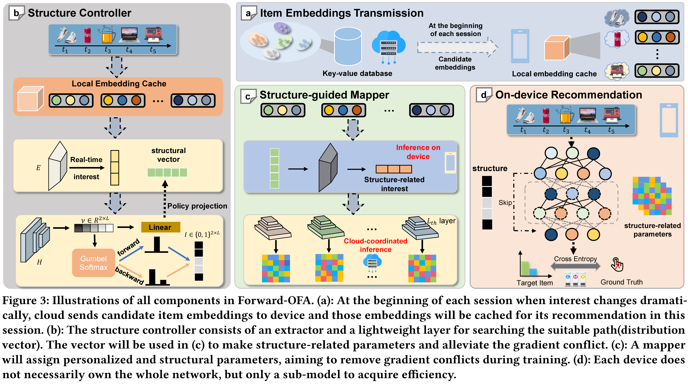
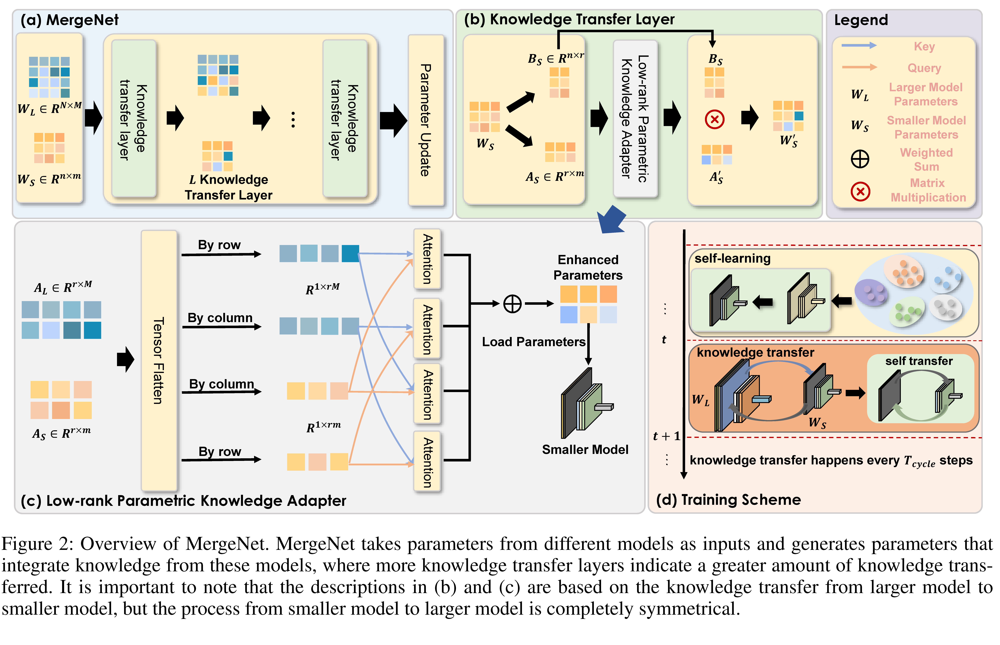
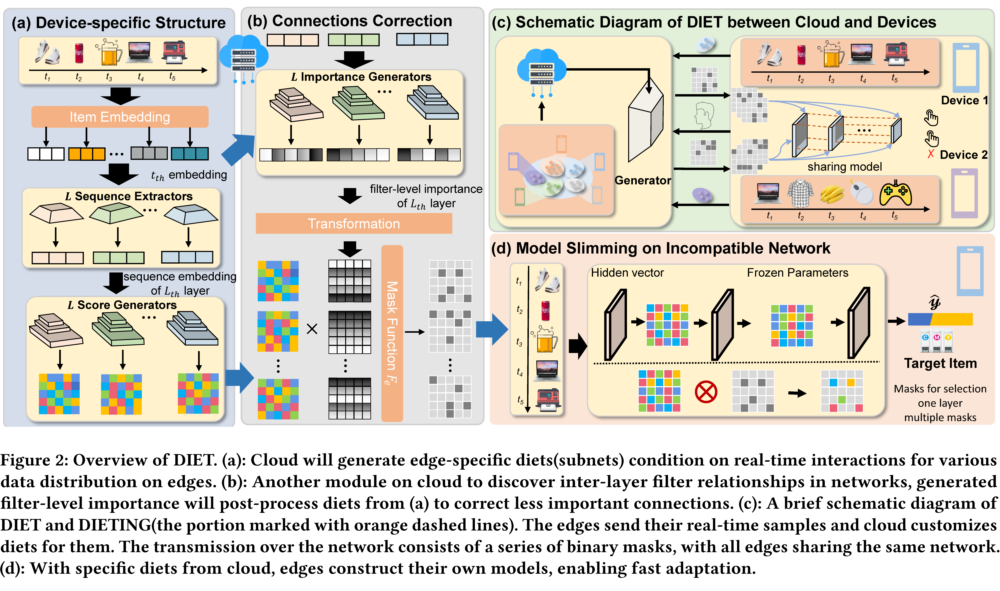
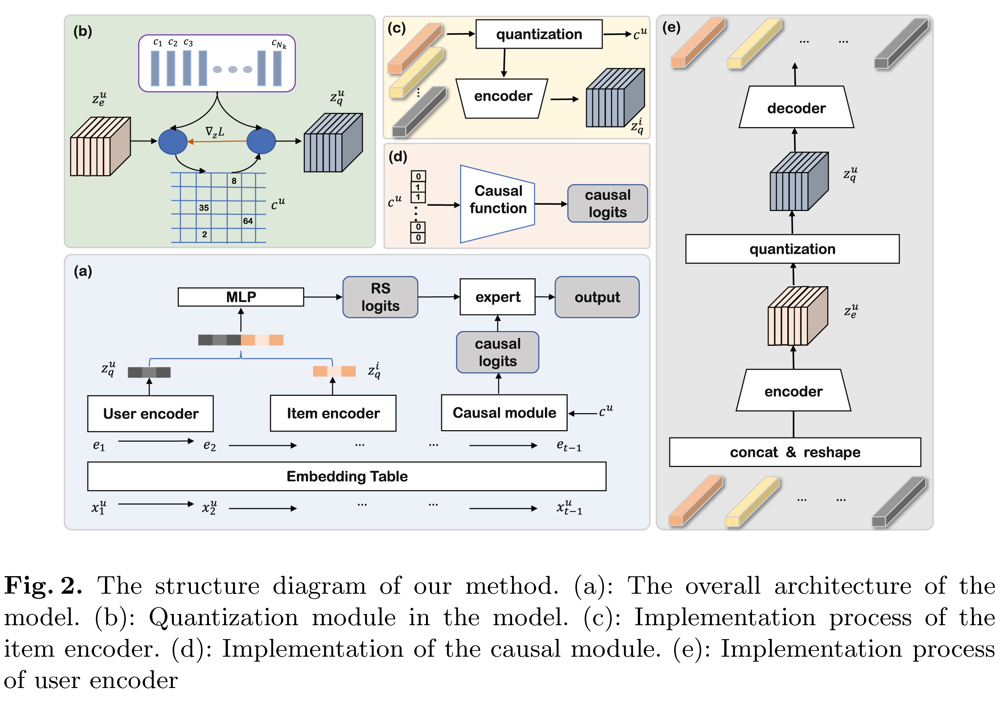








I am currently a second-year MS student at the College of Computer Science and Technology, Zhejiang University, under the supervision of Prof. [Kun Kuang](https://kunkuang.github.io/) and [Shengyu Zhang](https://shengyuzhang.github.io/).

My research primarily focuses on the generalizability and personalization of recommender systems. I also tackle the distinctive challenges related to the seamless integration of heterogeneous models across various computational environments, including both edge devices and cloud servers. Recently I am inerested in the scaling law of recommender system and focus on the efficient inference of large recommendation models when facing much longer user interaction sequences.

I am actively seeking job opportunities and will graduate in March 2026. Please feel free to contact me if there are any suitable positions available.

# 🔥 News
- *2024.12*: &nbsp;🎉🎉 One co-first-author paper has been accepted to AAAI 2025.
- *2024.11*: &nbsp;🎉🎉 One first-author paper has been accepted to KDD 2025 August Cycle(Research Track).
- *2024.08* &nbsp;🥳🥳 I went to Barcelona, Spain to attend the KDD conference to deliver an oral presentation of our paper DIET.
- *2024.05*: &nbsp;🎉🎉 One first-author paper has been accepted to KDD 2024(Research Track).
- *2023.07*: &nbsp;🥳🥳 I went to Fuzhou, China to attend the CICAI conference to deliver an oral presentation and won the Best Paper Award.
- *2023.06*: &nbsp;🎉🎉 One first-author paper has been accepted to CICAI 2023.

# 📝 Publications 

KDD 2025 August Cycle(to appear)

[Forward Once for All: Structural Parameterized Adaptation for Efficient Cloud-coordinated On-device Recommendation](https://arxiv.org/abs/2501.02837)

**Kairui Fu**, Zheqi Lv, Shengyu Zhang, Fan Wu, Kun Kuang

- An early attempt to investigate the joint customization of both structure and parameters, analyzing the challenges of interest heterogeneity, network transmission, and on-device inference simultaneously.

AAAI 2025(to appear)

[MergeNet: Knowledge Migration across Heterogeneous Models, Tasks, and Modalities](https://arxiv.org/abs/2404.13322)

Kunxi Li\*, Tianyu Zhan\*, **Kairui Fu\***, Shengyu Zhang, Kun Kuang, Jiwei Li, Zhou Zhao, Fan Wu, Fei Wu

- Leverage parameters as the medium to achieve knowledge transfer between heterogeneous models, tasks and modalities.

KDD 2024

[DIET: Customized Slimming for Incompatible Networks in Sequential Recommendation](https://dl.acm.org/doi/abs/10.1145/3637528.3671669)

**Kairui Fu**, Shengyu Zhang, Zheqi Lv, Jingyuan Chen, Jiwei Li

- Tackle both the parameter personalization and the communication efficiency under strict device constraints in device-cloud collaborative recommendation.

CICAI 2023 <b>Best Paper</b>

[End-to-End Optimization of Quantization-Based Structure Learning and Interventional Next-Item Recommendation](https://link.springer.com/chapter/10.1007/978-981-99-8850-1_34)

**Kairui Fu**, Qiaowei Miao, Shengyu Zhang, Kun Kuang, Fei Wu

- Investigate the inconsistent distribution of users in recommender system and the difficulty in causal structure learning accompanied by the intervention of recommender system.

*\* denote the authors contributed equally.*

# 🎖 Honors and Awards
- *2024.12* Huawei Jingying Scholarship (Top 1%)
- *2023.7* Best Paper Award in CICAI 2023 (Top 1)
- *2023.6* Outstanding Graduates of Zhejiang University
- *2022.10* Scholarship of Zhejiang University
- *2021.10* Scholarship of Zhejiang University
- *2020.10* Scholarship of Zhejiang University

# 📖 Educations
- *2023.09 - present*, Master, Computer Science and Technology, Zhejiang University, Hangzhou.
- *2019.09 - 2023.06*, Undergraduate, Turing Class(Chu Kochen Honors College), Computer Science and Technology, Zhejiang University, Hangzhou

# 💻 Internships
- *2025.03 - Present*, [Huawei Noah’s Ark Lab](http://dev3.noahlab.com.hk/index.html), China.